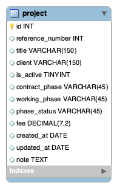

# EventTrackerProject

## Overview

Full-Stack Java Spring project backed by a mySQL database that implements a basic REST API. 
Allows the user to view and modify architectural projects (`events`) within a database using the REST route URIs charted below. 
The project tracker functions are designed for staff of an architectural firm, allowing them to add, update, and remove 
projects as they progress through design phases. Project inserts with id values 1-5 are pre-populated.

## Database Schema

## REST API

| Return Type      | Route                     | Functionality                      |
|------------------|---------------------------|------------------------------------|
| `List<Project>`  |`GET api/projects`         | Gets all projects                  |
| `List<Project>`  |`GET api/projects/active`  | Gets all 'active' projects         |
| `Project`        |`GET api/projects/{id}`    | Gets one project by id             |
| `Project`        |`POST api/projects`        | Creates a new project              |
| `Project`        |`PUT api/projects/{id}`    | Replaces an existing project by id |
| `void`           |`DELETE api/projects/{id}` | Deletes an existing project by id  |

### Technologies Used

- JPA
- REST API
- Postman
- JSON
- Spring Tool Suite
- JUnit
- Git
- GitHub
- MySQL

### Lessons Learned

- Mapped a POJO entity class to a database table using JPA.
- Applied Spring REST annotations to the project controller, with GET, POST, PUT, and DELETE mappings with 
Path Variables and Request Bodies.
- Created a project repository, extending the Spring JPA Repository to complete create, read (all and by id), update, and delete functions.
- Tested functionality in Postman with JSON input/outputs.

## Javascript/AJAX Front End

### Technologies Used

- JavaScript
- AJAX

### Lessons Learned

- Sent asynchronous GET/POST/PUT/DELETE requests to Java controllers using JavaScript's XMLHttpRequest.
- Wrote JavaScript that accesses and manipulates the DOM. Dynamically created HTML elements taht are 
adaptive to form values and JSON responses.
- Aggregated project data and presented a summary preceding the representation of filtered event objects: 
users can select all projects with a boolean `isActive` field set to true, and view the correlated 
project count and the sum of the contract values.

## Angular Front End

### Technologies Used

- Angular
- Bootstrap

### Lessons Learned

- Created components that called service methods to display database information.
- Sent asynchronous requests using HttpClient to interact with the RESTful API.
- Employed Angular directives to bind models to form inputs.
- Used built-in pipes to formate displayed data for currency and dates; injected a custom pipe to allow the user
 to display all projects or only active projects, and to display an active projects count.
- Employed routing to direct component display and navigation by url; passed data using route params.
